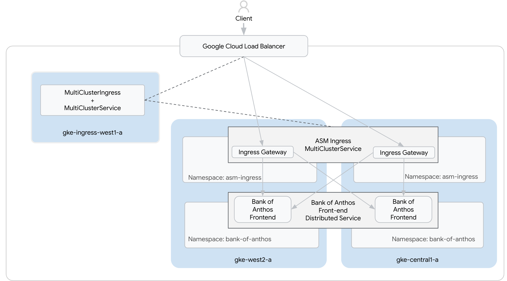
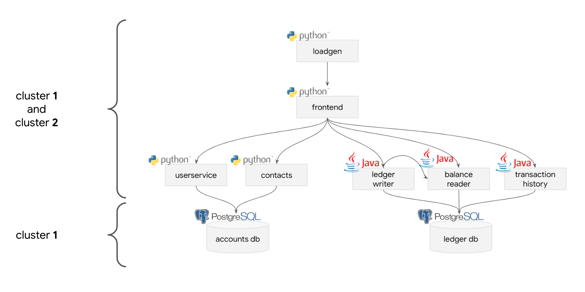

# Resources used during IstioCon 2022 for the Anthos Service Mesh (ASM) workshop

The pre-provisioned infrastructure of this workshop is in the [terraform folder](./terraform).
_**Important note**: These resources have been taken as-is from the Qwiklab platform in order to share them with a broader audience. But be aware that deploying the Terraform part as-is won't work and will need some extra adjustements._

The actual instructions of the workshop could be found [here](./instructions/en.md).

Here is the architecture diagram for this setup:

This workshop is leveraging the [Bank of Anthos sample apps](https://github.com/GoogleCloudPlatform/bank-of-anthos):

This content is to show case different services such as:
- Google Kubernetes Engine (GKE)
- Anthos Service Mesh (ASM) with Managed Control Plane (MCP) and Managed Data Plane (MDP) in Multi-clusters setup
- Anthos Config Management (ACM) with Policy Controller
- Multi-cluster Ingress (MCI)
- Cloud Trace
- Cloud Monitoring
- SLOs