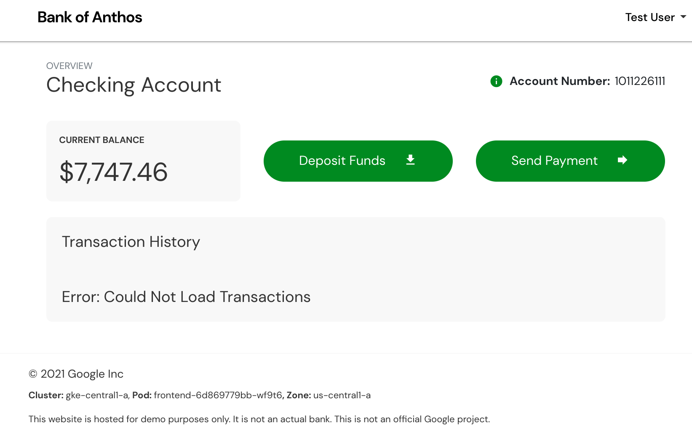
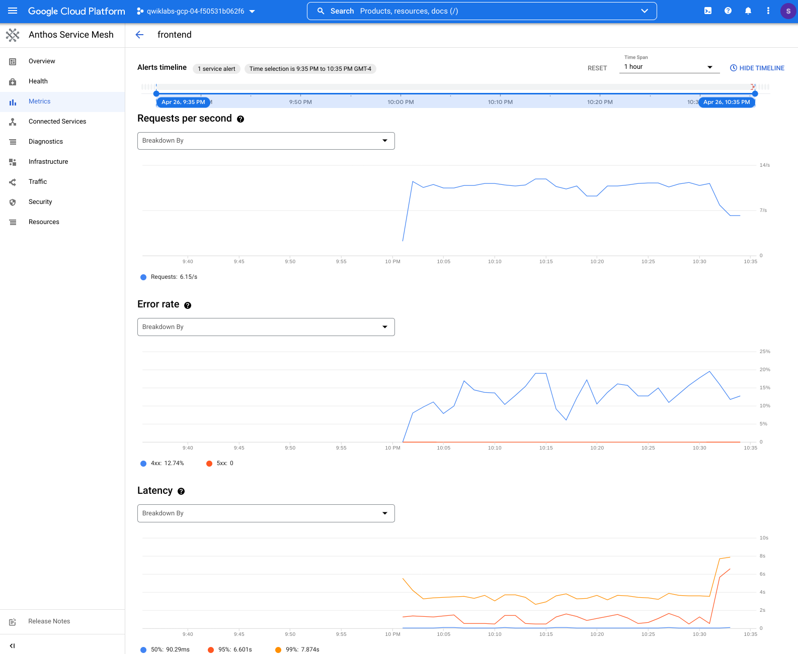
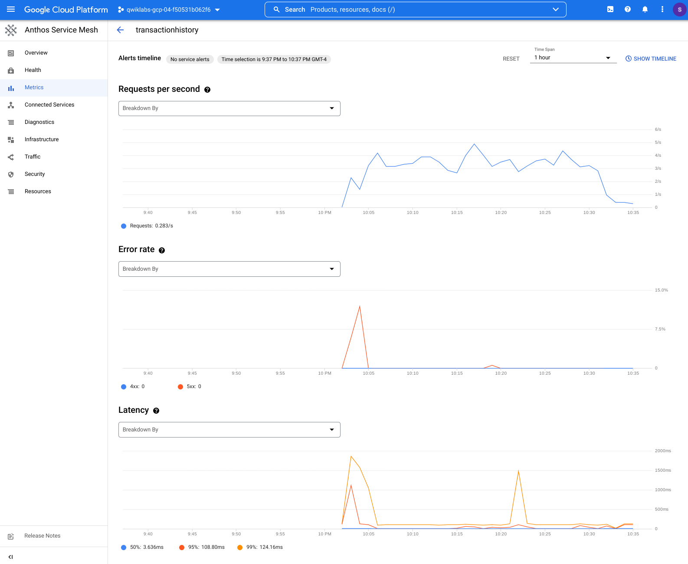
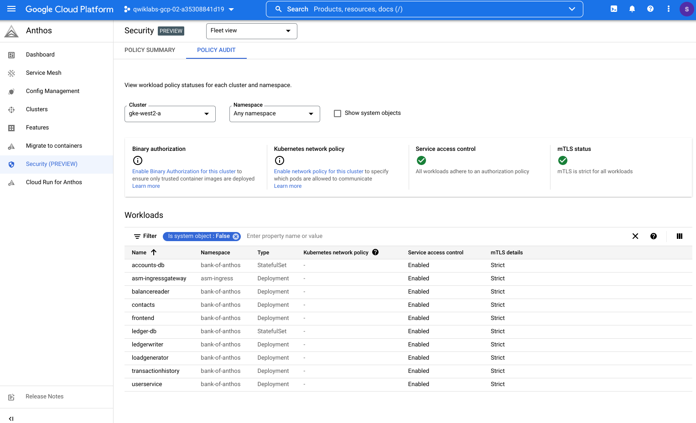

# Manage and Secure Distributed Services with Anthos Service Mesh


## SAW030


## Overview

This lab shows you how to run distributed services on multiple Google Kubernetes Engine (GKE) clusters in Google Cloud Platform (GCP) using Anthos Service Mesh. Anthos Service Mesh is Google’s fully managed Istio-compliant service mesh, which ultimately unburdens your operations and development teams.

You will perform the following steps:
- Configure Managed Anthos Service Mesh.
- Deploy Bank of Anthos, a sample app comprised of 6 stateless services and 2 databases, into your mesh.
- Deploy an Ingress Gateway to allow ingress to Bank of Anthos through a public IP address.
- See in action distributed services across two clusters.
- Use Google Cloud's Multi Cluster Ingress controller to load balance ingress across clusters.
- Understand the value of the two main Anthos Service Mesh features: Managed Control Plane and Managed Data Plane.
- Explore the Google Cloud Console (UI) to view health and performance of your services in your mesh.
- Define SLO, generate fault injections and SLO burn rate alerts


Lastly, you could perform this optional step:
- Enforce policy constraints to improve your security posture (`STRICT` mTLS and `AuthorizationPolicies`) with your clusters and your mesh with Policy Controller, a component of Anthos Config Management.

### Lab resources

You start this lab with already three clusters provisioned for you:
1. A cluster in the `us-west2-a` zone where you will deploy Bank of Anthos.
2. A cluster in the `us-central1-a` zone where you will deploy Bank of Anthos — without the databases.
3. A cluster in the `us-west1-a` zone which you will use to configure a Multi Cluster Ingress and Service for directing user traffic to the Bank of Anthos deployments in the first two clusters.


## Getting started with Qwiklabs

![[/fragments/startqwiklab]]

![[/fragments/gcpconsole]]


## Open Cloud Shell

1.  Click the [Cloud Shell](https://cloud.google.com/shell/docs/features) icon in the upper right-hand corner. When prompted, click __Continue__.


At the bottom of the Cloud Console page, a terminal session will start and display a command-line prompt. Cloud Shell is a shell environment with the Cloud SDK and the [gcloud command-line tool](https://cloud.google.com/sdk/gcloud) already installed, and with values already set for your current project. It can take a few seconds for the session to initialize.


## Prepare your environment

You will be working from your home directory on Cloud Shell and in a single Google Cloud project. Set these environment variables.
```bash
export WORKDIR=~
export PROJECT_ID=${DEVSHELL_PROJECT_ID}
```

Download resources you will be using in this lab.
```bash
gcloud storage cp --recursive gs://${PROJECT_ID}/* ${WORKDIR}
```

If you see a pop-up asking you to authorize Cloud Shell, click "Authorize".

Define the environment variables that you will use in this lab by running the command before. These variables include the names and locations (zones) of the GKE clusters, the version of Anthos Service Mesh you will install, and more.

```bash
source vars.sh
```

<ql-infobox><strong>Note</strong>: Cloud Shell may disconnect occasionally — for instance, due to inactivity. You will need to rerun <code>source vars.sh</code> every time you reconnect to Cloud Shell.</ql-infobox>


## Connect to GKE clusters

Connect to the three GKE clusters that have already been created for you:
```bash
gcloud container clusters get-credentials ${CLUSTER_1} \
  --zone ${CLUSTER_1_ZONE}
gcloud container clusters get-credentials ${CLUSTER_2} \
  --zone ${CLUSTER_2_ZONE}
gcloud container clusters get-credentials ${CLUSTER_INGRESS} \
  --zone ${CLUSTER_INGRESS_ZONE}
```

Rename the cluster contexts so the clusters are easy to work with:
```bash
kubectl config rename-context \
  gke_${PROJECT_ID}_${CLUSTER_1_ZONE}_${CLUSTER_1} \
  ${CLUSTER_1}
kubectl config rename-context \
  gke_${PROJECT_ID}_${CLUSTER_2_ZONE}_${CLUSTER_2} \
  ${CLUSTER_2}
kubectl config rename-context \
  gke_${PROJECT_ID}_${CLUSTER_INGRESS_ZONE}_${CLUSTER_INGRESS} \
  ${CLUSTER_INGRESS}
```

Check that the new names have been applied.
```bash
kubectl config get-contexts --output="name"
```

The output is similar to:
```output
gke-central1-a
gke-ingress-west1-a
gke-west2-a
```

## Configure Managed Anthos Service Mesh

In this section, you configure the Managed Anthos Service Mesh in clusters 1 and 2. To do this, you use the fleet feature API to set up Managed Anthos Service Mesh with [automatic control plane management](https://cloud.google.com/service-mesh/docs/managed/auto-control-plane-with-fleet). When you enable automatic control plane management on a GKE cluster, Google applies the recommended configuration of managed Anthos Service Mesh based on your cluster's release channel and keeps it up to date.

Managed Anthos Service Mesh is available in three different release channels: `Rapid`, `Regular`, and `Stable`. The release channel determines how quickly your mesh is upgraded when a new Anthos Service Mesh release is available. In this workshop, we use the `Rapid` release channel. You can learn more about release channels in the guide, [Select a managed Anthos Service Mesh release channel](https://cloud.google.com/service-mesh/docs/managed/select-a-release-channel).

Enable the Anthos Service Mesh automatic control plane management in clusters 1 and 2:
```bash
gcloud container fleet mesh update \
    --control-plane automatic \
    --memberships ${CLUSTER_1},${CLUSTER_2}
```

Wait until the Managed Anthos Service Mesh has been successfully enabled in clusters 1 and 2:
```bash
watch -g "gcloud container fleet mesh describe | grep 'code: REVISION_READY'"
```
<ql-infobox><strong>Note</strong>: This process should be complete within <strong>10 minutes</strong>.</ql-infobox>

Verify that Managed Anthos Service Mesh is successfully installed in your clusters 1 and 2.
```bash
gcloud container fleet mesh describe | grep servicemesh: -B 1 -A 5
```

The output is similar to:
```output
  projects/820495388507/locations/global/memberships/gke-central1-a:
    servicemesh:
      controlPlaneManagement:
        details:
        - code: REVISION_READY
          details: 'Ready: asm-managed-rapid'
        state: ACTIVE
--
  projects/820495388507/locations/global/memberships/gke-ingress-west1-a:
    servicemesh:
      controlPlaneManagement:
        state: DISABLED
    state:
      code: OK
      description: Please see https://cloud.google.com/service-mesh/docs/install for
--
  projects/820495388507/locations/global/memberships/gke-west2-a:
    servicemesh:
      controlPlaneManagement:
        details:
        - code: REVISION_READY
          details: 'Ready: asm-managed-rapid'
        state: ACTIVE
```

## Enable service discovery across clusters

After the Managed Anthos Service Mesh is configured for clusters 1 and 2, you can configure cross cluster service discovery. Cross cluster service discovery allows the two clusters to discover service endpoints from the remote cluster. Distributed services run on multiple clusters in the same namespace. In order for both Anthos Service Mesh control planes to discover all of the endpoints of a distributed service, it must have access to all of the clusters running the distributed service. In this example, we have two clusters. Therefore, both clusters must be able to query the remote cluster for service endpoints. To configure cross cluster service discovery, you create a `Secret` with the remote cluster’s kubeconfig. You will leverage the `asmcli` utility to help you with that.

Download the latest version of `asmcli` and make it executable:
```bash
curl https://storage.googleapis.com/csm-artifacts/asm/asmcli > asmcli
chmod +x asmcli
```

Configure endpoint discovery between clusters 1 and 2 using `asmcli`:
```bash
./asmcli create-mesh \
  ${PROJECT_ID} \
  ${PROJECT_ID}/${CLUSTER_1_ZONE}/${CLUSTER_1} \
  ${PROJECT_ID}/${CLUSTER_2_ZONE}/${CLUSTER_2}
```
<ql-infobox><strong>Note</strong>: This step takes about <strong>2 minutes</strong>.</ql-infobox>


## Deploy Bank of Anthos

With Managed Anthos Service Mesh enabled and cluster-to-cluster service discovery enabled, you can now deploy the Bank of Anthos application. 

You will deploy the stateless services of Bank of Anthos to both cluster 1 and 2. However, the two stateful PostgreSQL database services will only be deployed to cluster 1 in order to only have one place where the data are stored.


Create a dedicated `Namespace` for the Bank of Anthos apps in clusters 1 and 2.
```bash
kubectl --context=${CLUSTER_1} apply -f ${WORKDIR}/bank-of-anthos/namespace.yaml
kubectl --context=${CLUSTER_2} apply -f ${WORKDIR}/bank-of-anthos/namespace.yaml
```
<ql-infobox>Note: This <code>Namespace</code> resource has the label <code>istio-injection: enabled</code> to be included in the service mesh and get the automatic injection of the sidecar Envoy proxies for every <code>Pod</code>. Furthermore, this <code>Namespace</code> also has the annotation <code>mesh.cloud.google.com/proxy: '{"managed":"true"}'</code> to ensure that the sidecar proxies are automatically upgraded in conjunction with the managed control plane.</ql-infobox>

Deploy Bank of Anthos's `Deployment` and `Service` resources in clusters 1 and 2.
```bash
kubectl --context=${CLUSTER_1} apply -f ${WORKDIR}/bank-of-anthos/manifests
kubectl --context=${CLUSTER_2} apply -f ${WORKDIR}/bank-of-anthos/manifests
```

<ql-infobox><strong>Note</strong>: The commands above also deploy a <code>loadgenerator</code> application which simulates user requests to the <code>frontend</code> service in order to generate traffics and telemetries for the other applications.</ql-infobox>

Wait for the `Pods` to be successfully deployed:
```bash
kubectl --context=${CLUSTER_1} -n ${BANK_OF_ANTHOS_NAMESPACE} wait --for=condition=ready pod --all --timeout=90s
kubectl --context=${CLUSTER_2} -n ${BANK_OF_ANTHOS_NAMESPACE} wait --for=condition=ready pod --all --timeout=90s
```

<ql-infobox><strong>Note</strong>: This step takes about <strong>3 minutes</strong>.</ql-infobox>

The output is similar to:
```output
pod/accounts-db-0 condition met
pod/balancereader-76d56b4685-r4j26 condition met
pod/contacts-674b7859b8-8x47l condition met
pod/frontend-6d869779bb-2pvmv condition met
pod/ledger-db-0 condition met
pod/ledgerwriter-b794fdbbb-jdsm5 condition met
pod/loadgenerator-c6dbd4c79-stgtl condition met
pod/transactionhistory-6864c67fdf-d5cmw condition met
pod/userservice-8554769665-b8w5j condition met
pod/accounts-db-0 condition met
pod/balancereader-76d56b4685-254nb condition met
pod/contacts-674b7859b8-p5xbd condition met
pod/frontend-6d869779bb-bwm4w condition met
pod/ledger-db-0 condition met
pod/ledgerwriter-b794fdbbb-72f6q condition met
pod/loadgenerator-c6dbd4c79-dhzh6 condition met
pod/transactionhistory-6864c67fdf-7gskd condition met
pod/userservice-8554769665-5dt57 condition met
```

Delete the two PostgreSQL database services from cluster 2 so that the databases only exist in cluster 1.
```bash
kubectl --context=${CLUSTER_2} -n ${BANK_OF_ANTHOS_NAMESPACE} delete statefulset accounts-db
kubectl --context=${CLUSTER_2} -n ${BANK_OF_ANTHOS_NAMESPACE} delete statefulset ledger-db
```

Having the Kubernetes `Services`  in both clusters is required for service discovery. When a service in one of the two clusters attempts to make a request, it needs first to perform a DNS lookup for the hostname to obtain the IP address. In GKE, the kube-dns server running in the cluster will handle this lookup; and hence a configured `Service` definition is required.

Verify that all `Pods` are running in both clusters with the `2/2` for the `READY` column — this indicates that there is a Istio Proxy next to each `Pod`.
```bash
kubectl --context=${CLUSTER_1} -n ${BANK_OF_ANTHOS_NAMESPACE} get pod
kubectl --context=${CLUSTER_2} -n ${BANK_OF_ANTHOS_NAMESPACE} get pod
```

The output is similar to:
```output
NAME                                  READY   STATUS    RESTARTS   AGE
accounts-db-0                         2/2     Running   0          10m
balancereader-76d56b4685-hmkjx        2/2     Running   0          10m
contacts-674b7859b8-6qffl             2/2     Running   0          10m
frontend-6d869779bb-g9snr             2/2     Running   0          10m
ledger-db-0                           2/2     Running   0          10m
ledgerwriter-b794fdbbb-6kdqm          2/2     Running   0          10m
loadgenerator-c6dbd4c79-c88t4         2/2     Running   0          10m
transactionhistory-6864c67fdf-wch2k   2/2     Running   0          10m
userservice-8554769665-g4f5c          2/2     Running   0          10m
NAME                                  READY   STATUS    RESTARTS   AGE
balancereader-76d56b4685-7xksb        2/2     Running   1          8m4s
contacts-674b7859b8-42z57             2/2     Running   0          8m3s
frontend-6d869779bb-kdqqd             2/2     Running   0          8m3s
ledgerwriter-b794fdbbb-qtjxw          2/2     Running   0          8m4s
loadgenerator-c6dbd4c79-48mrt         2/2     Running   0          8m3s
transactionhistory-6864c67fdf-twmfb   2/2     Running   1          8m3s
userservice-8554769665-h9v2h          2/2     Running   0          8m3s
```

Deploy the Anthos Service Mesh configs to both clusters. This creates the `VirtualService` for the frontend service. This allows you to ingress traffic to the `frontend` `Service`.
```bash
kubectl --context=${CLUSTER_1} apply -f ${HOME}/bank-of-anthos/frontend-virtualservice.yaml
kubectl --context=${CLUSTER_2} apply -f ${HOME}/bank-of-anthos/frontend-virtualservice.yaml
```


## Inspect distributed services

At this point, you have deployed the Bank of Anthos applications in clusters 1 and 2. All services except the databases run as distributed services. This means that from the perspective of all sidecar proxies, they see two `Pods` for every service, one `Pod` running in each cluster. You can inspect this by looking at the `proxy-config endpoints` of any of the proxies using the `istioctl` CLI command.

Inspect the `proxy-config endpoints` list on the `frontend` `Pod` in cluster 1.
```bash
export FRONTEND_1=$(kubectl --context=${CLUSTER_1} -n ${BANK_OF_ANTHOS_NAMESPACE} get pod -l app=frontend -o jsonpath='{.items[0].metadata.name}')
istioctl proxy-config endpoints \
  --context $CLUSTER_1 -n ${BANK_OF_ANTHOS_NAMESPACE} $FRONTEND_1 | grep ${BANK_OF_ANTHOS_NAMESPACE}
```

The output is similar to:
```output
10.112.0.6:8080                  HEALTHY     OK                outbound|8080||contacts.bank-of-anthos.svc.cluster.local
10.112.0.7:8080                  HEALTHY     OK                outbound|8080||ledgerwriter.bank-of-anthos.svc.cluster.local
10.112.1.7:5432                  HEALTHY     OK                outbound|5432||ledger-db.bank-of-anthos.svc.cluster.local
10.112.1.8:8080                  HEALTHY     OK                outbound|8080||transactionhistory.bank-of-anthos.svc.cluster.local
10.112.2.6:5432                  HEALTHY     OK                outbound|5432||accounts-db.bank-of-anthos.svc.cluster.local
10.112.2.7:8080                  HEALTHY     OK                outbound|80||frontend.bank-of-anthos.svc.cluster.local
10.112.3.5:8080                  HEALTHY     OK                outbound|8080||balancereader.bank-of-anthos.svc.cluster.local
10.112.3.6:8080                  HEALTHY     OK                outbound|8080||userservice.bank-of-anthos.svc.cluster.local
10.80.0.9:8080                   HEALTHY     OK                outbound|80||frontend.bank-of-anthos.svc.cluster.local
10.80.1.5:8080                   HEALTHY     OK                outbound|8080||contacts.bank-of-anthos.svc.cluster.local
10.80.2.5:8080                   HEALTHY     OK                outbound|8080||ledgerwriter.bank-of-anthos.svc.cluster.local
10.80.2.6:8080                   HEALTHY     OK                outbound|8080||balancereader.bank-of-anthos.svc.cluster.local
10.80.2.7:8080                   HEALTHY     OK                outbound|8080||transactionhistory.bank-of-anthos.svc.cluster.local
10.80.3.8:8080                   HEALTHY     OK                outbound|8080||userservice.bank-of-anthos.svc.cluster.local
```
<ql-infobox><strong>Note</strong>: Each distributed service has two endpoint IP addresses. These are the <code>Pod</code> IP addresses — one for each cluster. <code>ledger-db</code> and <code>accounts-db</code> have just one endpoint, as expected.</ql-infobox>

Inspect the `proxy-config clusters` list on the `frontend` `Pod` in cluster 1.
```bash
istioctl proxy-config clusters \
  --context $CLUSTER_1 -n ${BANK_OF_ANTHOS_NAMESPACE} $FRONTEND_1 | grep ${BANK_OF_ANTHOS_NAMESPACE}
```

The output is similar to:
```output
SERVICE FQDN                                            PORT     SUBSET     DIRECTION     TYPE             DESTINATION RULE
                                                        8080     -          inbound       ORIGINAL_DST
BlackHoleCluster                                        -        -          -             STATIC
InboundPassthroughClusterIpv4                           -        -          -             ORIGINAL_DST
PassthroughCluster                                      -        -          -             ORIGINAL_DST
accounts-db.bank-of-anthos.svc.cluster.local            5432     -          outbound      EDS
agent                                                   -        -          -             STATIC
balancereader.bank-of-anthos.svc.cluster.local          8080     -          outbound      EDS
contacts.bank-of-anthos.svc.cluster.local               8080     -          outbound      EDS
default-http-backend.kube-system.svc.cluster.local      80       -          outbound      EDS
frontend.bank-of-anthos.svc.cluster.local               80       -          outbound      EDS
kube-dns.kube-system.svc.cluster.local                  53       -          outbound      EDS
kubernetes.default.svc.cluster.local                    443      -          outbound      EDS
ledger-db.bank-of-anthos.svc.cluster.local              5432     -          outbound      EDS
ledgerwriter.bank-of-anthos.svc.cluster.local           8080     -          outbound      EDS
metrics-server.kube-system.svc.cluster.local            443      -          outbound      EDS
prometheus_stats                                        -        -          -             STATIC
sds-grpc                                                -        -          -             STATIC
transactionhistory.bank-of-anthos.svc.cluster.local     8080     -          outbound      EDS
userservice.bank-of-anthos.svc.cluster.local            8080     -          outbound      EDS
xds-grpc                                                -        -          -             STATIC
zipkin                                                  -        -          -             STRICT_DNS
```

By default, Istio will program all sidecar proxies in the mesh with the necessary configuration required to reach every workload instance in the mesh, as well as accept traffic on all the ports associated with the workload. The [`Sidecar` configuration](https://istio.io/latest/docs/reference/config/networking/sidecar/) provides a way to fine tune the set of services, ports, protocols that the proxy will accept when forwarding traffic to and from the workload. It is a best practice to set fine granular `Sidecar` resources in order to minimize the CPU and memory usage of the Istio sidecar proxies in your mesh.

Deploy the `Sidecar` resources (one per Bank of Anthos app) in clusters 1 and 2.
```bash
kubectl --context ${CLUSTER_1} apply -f ${WORKDIR}/bank-of-anthos/sidecars.yaml
kubectl --context ${CLUSTER_2} apply -f ${WORKDIR}/bank-of-anthos/sidecars.yaml
```

Inspect again the `proxy-config clusters` list on the `frontend` `Pod` in cluster 1.
```bash
istioctl proxy-config clusters \
  --context $CLUSTER_1 -n ${BANK_OF_ANTHOS_NAMESPACE} $FRONTEND_1 | grep ${BANK_OF_ANTHOS_NAMESPACE}
```

The output is similar to:
```output
SERVICE FQDN                                            PORT     SUBSET     DIRECTION     TYPE             DESTINATION RULE
                                                        8080     -          inbound       ORIGINAL_DST
BlackHoleCluster                                        -        -          -             STATIC
InboundPassthroughClusterIpv4                           -        -          -             ORIGINAL_DST
PassthroughCluster                                      -        -          -             ORIGINAL_DST
agent                                                   -        -          -             STATIC
balancereader.bank-of-anthos.svc.cluster.local          8080     -          outbound      EDS
contacts.bank-of-anthos.svc.cluster.local               8080     -          outbound      EDS
ledgerwriter.bank-of-anthos.svc.cluster.local           8080     -          outbound      EDS
prometheus_stats                                        -        -          -             STATIC
sds-grpc                                                -        -          -             STATIC
transactionhistory.bank-of-anthos.svc.cluster.local     8080     -          outbound      EDS
userservice.bank-of-anthos.svc.cluster.local            8080     -          outbound      EDS
xds-grpc                                                -        -          -             STATIC
zipkin                                                  -        -          -             STRICT_DNS
```

You could see that number of `proxy-config clusters` has decreased for the `frontend` `Pod` in cluster 1.


## Deploy Ingress Gateway

In this section you deploy the resources needed to set up an Ingress Gateway in clusters 1 and 2. Note that an Ingress Gateway isn't automatically deployed when you previously enabled Managed Anthos Service Mesh in your clusters. Decoupling the deployment of the Ingress Gateway and the control plane allows you to more easily manage your gateways in a production environment.

Create a dedicated `Namespace` for the Ingress Gateway in clusters 1 and 2.
```bash
kubectl --context ${CLUSTER_1} apply -f ${WORKDIR}/asm-ingressgateway/namespace.yaml
kubectl --context ${CLUSTER_2} apply -f ${WORKDIR}/asm-ingressgateway/namespace.yaml
```
<ql-infobox>Note: This <code>Namespace</code> resource has the label <code>istio-injection: enabled</code> to be included in the service mesh and get the automatic injection of the gateway as an Envoy proxy. Furthermore, this <code>Namespace</code> also has the annotation <code>mesh.cloud.google.com/proxy: '{"managed":"true"}'</code> to ensure that the injected gateway is automatically upgraded in conjunction with the managed control plane.</ql-infobox>

Deploy the Ingress Gateway's `Deployment` and `Service` resources in clusters 1 and 2.
```bash
kubectl --context ${CLUSTER_1} apply -f ${WORKDIR}/asm-ingressgateway/asm-ingressgateway.yaml
kubectl --context ${CLUSTER_2} apply -f ${WORKDIR}/asm-ingressgateway/asm-ingressgateway.yaml
```

Deploy the Ingress Gateway's `Gateway` resource in clusters 1 and 2.
```bash
kubectl --context ${CLUSTER_1} apply -f ${WORKDIR}/asm-ingressgateway/gateway.yaml
kubectl --context ${CLUSTER_2} apply -f ${WORKDIR}/asm-ingressgateway/gateway.yaml
```
<ql-infobox>Note: <code>Gateways</code> are generally owned by the platform admins or network admins team. Therefore, the <code>Gateways</code> resource is created in the Ingress Gateway namespace owned by the platform admin and could be use in other namespaces via their own <code>VirtualService</code> entries. This model is called <a href="https://istio.io/latest/docs/setup/additional-setup/gateway/#shared-gateway">Shared Gateway</a>.</ql-infobox>

Wait until the Ingress Gateway public IP addresses are provisioned:
```bash
until kubectl --context=${CLUSTER_1} -n ${INGRESS_GATEWAY_NAMESPACE} get svc asm-ingressgateway -o jsonpath='{.status.loadBalancer}' | grep "ingress"; do : ; done
until kubectl --context=${CLUSTER_2} -n ${INGRESS_GATEWAY_NAMESPACE} get svc asm-ingressgateway -o jsonpath='{.status.loadBalancer}' | grep "ingress"; do : ; done
```
<ql-infobox><strong>Note</strong>: This process should be complete within <strong>2 minutes</strong>. The command will output the public IPs once provisioned</ql-infobox>
The output is similar to:
```output
{"ingress":[{"ip":"34.94.189.145"}]}
{"ingress":[{"ip":"34.68.58.52"}]}
```

## Access Bank of Anthos

To recap what we have accomplished so far, here is the architecture of clusters 1 and 2, with their setup with Anthos Service Mesh Managed Control Plane, an Ingress Gateway and the Bank of Anthos applications:


You can access Bank of Anthos using the Ingress Gateway's public IP addresses from cluster 1 and 2. Click on the IP outputted by the commands below:
```bash
echo -n "http://" && \
kubectl --context ${CLUSTER_1} -n ${INGRESS_GATEWAY_NAMESPACE} \
  get svc asm-ingressgateway -o json | jq -r '.status.loadBalancer.ingress[0].ip'
echo -n "http://" && \
kubectl --context ${CLUSTER_2} -n ${INGRESS_GATEWAY_NAMESPACE} \
  get svc asm-ingressgateway -o json | jq -r '.status.loadBalancer.ingress[0].ip'
```
The output is similar to:
```output
http://34.94.170.168
http://34.135.11.242
```

You will see the Bank of Anthos website — fully functional.

If you refresh the sign-in page multiple times using either IP address and look at the footer, you will see the value of **Cluster**, **Pod** and **Zone** toggle between cluster 1 and 2. This indicates that the `frontend` is bouncing between the two instances deployed in the mesh, accross cluster 1 and 2. This is our first illustration of deploying distributed services accross multiple clusters.


You can now sign in, deposit funds to your account and transfer funds to other accounts. Another illustration of distributed services deployed accross multiple clusters, is that you will see that even if we have the databases in one region, the website in the other region is also able to display the transactions you just made.


## Configure Multi-Cluster Ingress

In this section, you use Google Cloud's [Multi Cluster Ingress](https://cloud.google.com/kubernetes-engine/docs/concepts/multi-cluster-ingress) controller to load balance user-to-frontend traffic across clusters 1 and 2. You use [Cloud Load Balancing](https://cloud.google.com/load-balancing/docs/load-balancing-overview) to create a load balancer that uses the `asm-ingressgateway` Services in both clusters as backends. You will use the third cluster to configure this setup. To create the load balancer, you need two resources:

* a `MultiClusterIngress` and 
* one or more `MultiClusterServices`. 

`MultiClusterIngress` and `MultiClusterService` objects are multi-cluster analogs for the existing Kubernetes Ingress and Service resources used in the single cluster context.

Enable Multi-cluster Ingress on the third cluster:
```bash
gcloud container fleet ingress enable \
  --config-membership=projects/${PROJECT_ID}/locations/global/memberships/${CLUSTER_INGRESS}
```

<ql-infobox><strong>Note</strong>: This step takes about <strong>2 minutes</strong>.</ql-infobox>

The output is similar to:
```output
Waiting for Feature Ingress to be created...done.     
Waiting for controller to start......done.
```

Verify that Multi-cluster Ingress is enabled on the third cluster.
```bash
gcloud container fleet ingress describe | grep "multiclusteringress:" -A 1
```

The output is similar to:
```output
  multiclusteringress:
    configMembership: projects/qwiklabs-gcp-01-eccdd0b97bac/locations/global/memberships/gke-ingress-west1-a
```

You need to deploy the `MultiClusterIngress` and `MultiClusterService` resources into the namespace that contains the Ingress Gateway Deployment of clusters 1 and 2. Create the namespace in cluster 3.
```
kubectl --context=${CLUSTER_INGRESS} create namespace ${INGRESS_GATEWAY_NAMESPACE}
```

Deploy the `MultiClusterIngress` and the `MultiClusterService`.
```bash
kubectl --context=${CLUSTER_INGRESS} apply -f ${WORKDIR}/multi-cluster-ingress/multi-cluster-ingress.yaml
kubectl --context=${CLUSTER_INGRESS} apply -f ${WORKDIR}/multi-cluster-ingress/multi-cluster-service.yaml
```

The `MultiClusterService` you deployed to cluster 3 will create a ["headless"](https://kubernetes.io/docs/concepts/services-networking/service/#headless-services) `Service` in cluster 1 and 2. Verify that the "headless" `Services` have been created:

```bash
kubectl --context=${CLUSTER_1} -n ${INGRESS_GATEWAY_NAMESPACE} \
  get services | grep frontend-multi-cluster-service
kubectl --context=${CLUSTER_2} -n ${INGRESS_GATEWAY_NAMESPACE} \
  get services | grep frontend-multi-cluster-service
```

The output is similar to:
```output
mci-frontend-multi-cluster-service-svc-f7rcyqry22iq8nmw   ClusterIP      None          <none>          80/TCP         77s
mci-frontend-multi-cluster-service-svc-f7rcyqry22iq8nmw   ClusterIP      None          <none>          80/TCP         78s
```

Wait for a few minutes for an IP address to be assigned to the `MultiClusterIngress` resource.
```bash
until kubectl --context ${CLUSTER_INGRESS} -n ${INGRESS_GATEWAY_NAMESPACE} get multiclusteringress frontend-multi-cluster-ingress -o jsonpath='{.status}' | grep VIP; do : ; done
```
<ql-infobox><strong>Note</strong>: This process should be complete within <strong>5 minutes</strong>. The command will output the public IPs once provisioned</ql-infobox>

The output is similar to:
```output
{"CloudResources":{"BackendServices":["mci-85d41g-80-asm-ingress-frontend-multi-cluster-service"],"Firewalls":["mci-85d41g-default-l7"],"ForwardingRules":["mci-85d41g-fw-asm-ingress-frontend-multi-cluster-ingress"],"HealthChecks":["mci-85d41g-80-asm-ingress-frontend-multi-cluster-service"],"NetworkEndpointGroups":["zones/us-central1-a/networkEndpointGroups/k8s1-d61c8375-asm-ing-mci-frontend-multi-cluster-ser-8-a567e283","zones/us-west2-a/networkEndpointGroups/k8s1-0e75ef6c-asm-ing-mci-frontend-multi-cluster-ser-8-49cedf6c"],"TargetProxies":["mci-85d41g-asm-ingress-frontend-multi-cluster-ingress"],"UrlMap":"mci-85d41g-asm-ingress-frontend-multi-cluster-ingress"},"VIP":"34.117.87.80"}
```

Visit the `MultiClusterIngress`'s IP address and check the footer of the page to see which cluster handled the request. Click on the link displayed by the command below:
```bash
echo -n "http://" && \
kubectl --context ${CLUSTER_INGRESS} -n ${INGRESS_GATEWAY_NAMESPACE} \
  get multiclusteringress frontend-multi-cluster-ingress -o json | jq -r '.status.VIP'
```

<ql-infobox><strong>Note</strong>: If you get a 404 error (or a 502 error), please wait a few minutes longer and then refresh the page in your web browser.</ql-infobox>

Congratulations! You have configured your clusters in order to set up highly available distributed services! Here is the summary of what you have:


## Verify control plane and data plane versions

[Managed Anthos Service Mesh](https://cloud.google.com/service-mesh/docs/managed/configure-managed-anthos-service-mesh) is a Google-managed control plane and an optional data plane that you simply configure. Google handles their reliability, upgrades, scaling and security for you.

The following diagram shows the Anthos Service Mesh components and features for [managed Anthos Service Mesh](https://cloud.google.com/service-mesh/docs/overview#managed_anthos_service_mesh):


When we installed Anthos Service Mesh earlier in this workshop, we chose a specific [release channel](https://cloud.google.com/service-mesh/docs/managed/select-a-release-channel#available_release_channels). Anthos Service Mesh release channels are similar conceptually to GKE release channels but are independent of GKE release channels. Google automatically manages the version and upgrade cadence for each release channel.

In Ingress Gateway and Bank of Anthos namespaces, we also enabled the [Google-managed data plane](https://cloud.google.com/service-mesh/docs/managed/auto-control-plane-with-fleet#managed-data-plane). When Google-managed data plane is enabled, the sidecar proxies and injected gateways are automatically upgraded in conjunction with the managed control plane.

With both features, managed control plane and managed data plane, you don't have to worry anymore about Istio version upgrades.

You can view the versions of the control plane (`revision` column below) and data plane (`proxy-version` column below) in **Metrics Explorer**. Click on the link displayed by the command below:
```bash
echo $ASM_CONTROL_PLANE_METRICS_URL
```


## Enable Cloud Trace

[Cloud Trace](https://cloud.google.com/service-mesh/docs/observability/accessing-traces) is a distributed tracing system that collects latency data from the applications and displays it in near real-time. It allows you to follow a sample request through your distributed system, observe the network calls and profile your system end to end.

This is very useful and required no extra developer effort with no need to add instrumentation logic within the service itself.

Because Cloud Trace is disabled by default with Anthos Service Mesh, let's enable this [optional feature](https://cloud.google.com/service-mesh/docs/managed/enable-managed-anthos-service-mesh-optional-features#enable_cloud_tracing):
```bash
kubectl --context ${CLUSTER_1} apply -f ${WORKDIR}/istio-system/mesh-configs.yaml
kubectl --context ${CLUSTER_2} apply -f ${WORKDIR}/istio-system/mesh-configs.yaml
```
<ql-infobox><strong>Note</strong>: You can ignore the <code>Warning</code> displayed in the output of these commands.</ql-infobox>

Restart the applications in order to get the sidecar proxies re-injected to pick up the tracer update:
```bash
kubectl --context=${CLUSTER_1} -n ${BANK_OF_ANTHOS_NAMESPACE} rollout restart deployments
kubectl --context=${CLUSTER_2} -n ${BANK_OF_ANTHOS_NAMESPACE} rollout restart deployments
kubectl --context=${CLUSTER_1} -n ${INGRESS_GATEWAY_NAMESPACE} rollout restart deployments
kubectl --context=${CLUSTER_2} -n ${INGRESS_GATEWAY_NAMESPACE} rollout restart deployments
```

[Access traces](https://cloud.google.com/service-mesh/docs/observability/accessing-traces) in Cloud Trace. Click on the link displayed by the command below:
```bash
echo -e "https://console.cloud.google.com/traces/list?project=${PROJECT_ID}"
```

While the `Deployments` are restarting and until getting the traces generated, you can either close or refresh the "Quickstart" page.

If you wait for a few minutes you will be able to find detailed information related to the generated traces. Like illustrated below, you can enable the __Auto Reload__ feature on that page to get near real-time traces. 


## Explore health and performance of your services

The [Anthos Service Mesh pages in the Google Cloud Console](https://cloud.google.com/service-mesh/docs/observability/explore-dashboard) provide both summary and in-depth metrics, charts, and graphs that enable you to observe service behavior. You can monitor the overall health of your services, or drill down on a specific service to set a service level objective (SLO) or troubleshoot an issue.

There are two ways to view your services:
- **Table view**
- **Topology view**

Navigate to the **Anthos > Service Mesh > Topology** and see the topology of your distributed services running in your mesh:
```bash
echo -e "https://console.cloud.google.com/anthos/services?project=${PROJECT_ID}&pageState=%28%22topologyViewToggle%22:%28%22value%22:%22graph%22%29%29"
```

Hover over the `frontend` service to view additional data (for example request per seconds to and from frontend to other services). Click on the **Expand** button on the frontend service. You should see a `Service` and a `Workload`. You can further expand workload into two `Deployments` and finally expand the `Deployments` into `Pods`. Now you can visually see the distributed services which are essentially a `Service` and two `Pods` for each application as shown in the figure below:


Navigate to the **Anthos > Service Mesh > Table view** and see in a tabular format your distributed services running in your mesh. Click on the link displayed by the command below:
```bash
echo -e "https://console.cloud.google.com/anthos/services?project=${PROJECT_ID}"
```


You can select a service to monitor from either the table or topology view. After you select a service, a left-navigation bar appears with links to the following pages:
- The **Overview** page displays SLO status, key metrics, and details about the service.
- The **Health** page displays SLO details.
- The **Metrics** page displays charts for key traffic and infrastructure metrics. You can break down the metrics in numerous ways, such as by cluster and `Pod`.
- The **Connected** services page displays details about inbound and outbound requests.
- The **Diagnostics** page displays error logs.
- The **Infrastructure** page displays key metrics and details about each `Pod`. You can click the `Pod` name to go to the Workloads page in the Cloud Console.

Click on the `frontend` service to navigate to its **Overview** page:


Click on **Metrics** from the left hand side navigation menu to view the [golden signals](https://sre.google/sre-book/monitoring-distributed-systems/#xref_monitoring_golden-signals).


## Define SLO and alert

In this section, you will define one SLO for the `frontend` service to track how healthy this service is. You will also set up one SLO burn rate alert in order to get notified as soon as the you have incident based on your SLO definition. 

Navigate to the **Health** view of the `frontend` service. Click on the link displayed by the command below:
```bash
echo -e "https://console.cloud.google.com/anthos/services/service/${BANK_OF_ANTHOS_NAMESPACE}/frontend/health?project=${PROJECT_ID}"
```


Click on the **+ Create SLO** button on the right of this screen to navigate to the **Set your service-level indicator (SLI)** step of the **Create a Service Level Objective (SLO)** wizard.


Select **Latency** in the **Choose a metric** section and click on **Continue** to navigate to the **Define SLI details** step.


Set the **Latency threshold** field to `2000` ms in the **Performance metric** section and click on **Continue** to navigate to the **Set your service-level objective (SLO)** step.


Set the **Period type** field to `Rolling` and the **Period length** field to `28` days in the **Compliance period** section.

Set the **Performance goal** field to `99.9` %.

Click on **Continue** to navigate to the **Review and save** step.


You can see the generated `JSON` value of this setup which could be potentially reused with your automation tool via the associated API, Terraform module, etc. The value of this `JSON` definition is similar to:
```output
{
  "displayName": "99.9% - Latency - Rolling 28 days",
  "goal": 0.999,
  "rollingPeriod": "2419200s",
  "serviceLevelIndicator": {
    "basicSli": {
      "latency": {
        "threshold": "2s"
      }
    }
  }
}
```

Click on the **Create SLO** button. You will now see this SLO created for the `frontend` service:


On the right of this screen, click on the **Create SLO alert** button associated to this SLO to navigate to the **Set SLO alert conditions** step of the **Create SLO burn rate policy** wizard.


Set the **Lookback duration** field to `1` minute(s), click on **Next**.


Click again on **Next** on the **Who should be notified** step and finally on **Save** on the last **What are the steps to fix the issue** step.

Congratulations! You now have your SLO and its associated burn rate alert.


## Generate fault injections and SLO burn rate alert

In this section, you will inject errors and delays in the `transactionhistory` service in order to see how these metrics and SLOs previously defined behave. We will leverage the native Istio's `VirtualService` resource to accomplish this, which allows fault injection without actually updating the code of your application. Really convenient to put in place a chaos monkey test.

Deploy a new `VirtualService` in clusters 1 and 2 for the `transactionhistory` service in order to `abort` 50% of the requests by returning a `500` HTTP status code and add `delay` for 50% of the requests.
```bash
kubectl --context=${CLUSTER_1} apply -f ${HOME}/bank-of-anthos/transaction-history-with-fault-virtualservice.yaml
kubectl --context=${CLUSTER_2} apply -f ${HOME}/bank-of-anthos/transaction-history-with-fault-virtualservice.yaml
```

Navigate to one of your Bank of Anthos website through one of the Public IP addresses generated earlier. From there if you hit refresh multiple times, you will see that the `frontend` will have both higher response time to display the list of the transactions (because of the `delay` we just added) and will properly display an error message **Error: Could Not Load Transactions** when `transactionhistory` is returning an error (because of the `abort` we just added).



Wait for a few minutes, while the `loadgenerator` application is generating more traffic with these errors injected and from there you will see the degradation for both `transactionhistory` and `frontend` services.

Navigate to the **Metrics** view of the `frontend` service to see that the **Requests per second** and **Latency** metrics for example are showing the degradation. Click on the link displayed by the command below:
```bash
echo -e "https://console.cloud.google.com/anthos/services/service/${BANK_OF_ANTHOS_NAMESPACE}/frontend/metrics?project=${PROJECT_ID}"
```



Navigate to the **Metrics** view of the `transactionhistory` service to see that the **Requests per second** and **Latency** metrics for example are showing the degradation. Click on the link displayed by the command below:
```bash
echo -e "https://console.cloud.google.com/anthos/services/service/${BANK_OF_ANTHOS_NAMESPACE}/transactionhistory/metrics?project=${PROJECT_ID}"
```

!

Navigate to the **Anthos > Anthos Service Mesh** dashboard. Click on the link displayed by the command below:
```bash
echo -e "https://console.cloud.google.com/anthos/services?project=${PROJECT_ID}"
```


You can see the message **1 service requires immediate action** after waiting for a few minutes. You can also see the associated red icon next to the `frontend` service in the table view of your **Services**. Navigate to the details view of the `frontend` service by clicking on it in this table.


In the **Service status: alert firing** section, click on **--> See SLO details**.


Click on the **Alerts firing 1/1** tab and then click on **View policy** to get more details about this burn rate alert:


From there you can take actions by fixing the issue, get webhooks or emails set up for the burn rate alerts, etc.


## (Optional) Enforce security in your Mesh with policy constraints

In this optional section you will install [Policy Controller](https://cloud.google.com/anthos-config-management/docs/concepts/policy-controller) in cluster 1 and then enforce some policies such as sidecar proxies injection, `STRICT` mTLS and `AuthorizationPolicies` in order to improve your security posture in your mesh.

<ql-infobox><strong>Note</strong>: To simplify the steps for this section of the workshop, we will only interacting with the cluster 1. These steps could be easily replicated in cluster 2. Ultimately, applying such policies could be done via a Gitops approach in order to deploy these resources at scale and consistently in your multi-clusters setup.</ql-infobox>

Policy Controller contains a [constraint templates library](https://cloud.google.com/anthos-config-management/docs/reference/constraint-template-library) that can be used with the out-of-the-box policies bundle to enforce specific Istio and Anthos Service Mesh security best practices. We will illustrate two group of policies in the following sections:
- How to enforce sidecar proxy injection
- How to enforce `STRICT` mTLS in the mesh
- How to enforce `AuthorizationPolicies` in the mesh

Install Policy Controller in cluster 1:
```bash
gcloud beta container fleet config-management apply \
  --membership ${CLUSTER_1} \
  --config ${WORKDIR}/acm-policy-controller.yaml
```

Wait for the `Policy_Controller` component is `INSTALLED` for cluster 1:
```bash
watch -g "gcloud beta container fleet config-management status | grep 'Policy_Controller: INSTALLED'"
```

<ql-infobox><strong>Note</strong>: The <code>watch</code> command will exit by itself as soon as the Policy Controller is <code>INSTALLED</code>. It can take up to 10 minutes.</ql-infobox>

Let's now enforce policies that ensure all workloads in the mesh have [automatic sidecar injection](https://cloud.google.com/service-mesh/docs/anthos-service-mesh-proxy-injection) and cannot bypass the sidecar:
- [`K8sRequiredLabels`](https://cloud.google.com/anthos-config-management/docs/reference/constraint-template-library#k8srequiredlabels) - requires any `Namespace` in the mesh to contain the specific Anthos Service Mesh sidecar proxy injection label: `istio-injection: enabled`
- [`K8sRequiredAnnotations`](https://cloud.google.com/anthos-config-management/docs/reference/constraint-template-library#k8srequiredannotations) - requires any `Namespace` in the mesh to contain the specific Anthos Service Mesh sidecar proxy injection annotation: `mesh.cloud.google.com/proxy: {"managed":"true"}`
- [`AsmSidecarInjection`](https://cloud.google.com/anthos-config-management/docs/reference/constraint-template-library#asmsidecarinjection) - prohibits any `Pod` in the Mesh to by-pass the Istio proxy sidecar injection

Deploy the `Constraints`:
```bash
kubectl --context ${CLUSTER_1} apply -f ${WORKDIR}/policies/sidecar-injection
```

Verify that the `Constraints` are created:
```bash
kubectl --context ${CLUSTER_1} get constraints
```

The output is similar to:
```output
NAME                                                                             ENFORCEMENT-ACTION   TOTAL-VIOLATIONS
asmsidecarinjection.constraints.gatekeeper.sh/pod-sidecar-injection-annotation   deny                 0
NAME                                                                            ENFORCEMENT-ACTION   TOTAL-VIOLATIONS
k8srequiredlabels.constraints.gatekeeper.sh/namespace-sidecar-injection-label   deny                 0
NAME                                                                                       ENFORCEMENT-ACTION   TOTAL-VIOLATIONS
k8srequiredannotations.constraints.gatekeeper.sh/namespace-sidecar-injection-annotation   deny                 0
```

Because we already properly set up our namespaces and `Pods` we could see that we have 0 `TOTAL-VIOLATIONS` for these three `Constraints`.

Now let's try to create a namespace in cluster 1 without `label` nor `annotation` and see in action these `Constraints`:
```bash
kubectl --context ${CLUSTER_1} create namespace test
```

The output is similar to:
```output
Error from server (Forbidden): admission webhook "validation.gatekeeper.sh" denied the request: [namespace-sidecar-injection-annotation] you must provide annotation(s): {"mesh.cloud.google.com/proxy"}
[namespace-sidecar-injection-label] you must provide labels: {"istio-injection"}
```


Let's now enforce policies that ensure all traffic within the mesh is [mTLS](https://cloud.google.com/service-mesh/docs/security/security-overview#mutual_tls):
- [`AsmPeerAuthnMeshStrictMtls`](https://cloud.google.com/anthos-config-management/docs/reference/constraint-template-library#asmpeerauthnmeshstrictmtls) - requires a default `STRICT` mTLS `PeerAuthentication` for the entire mesh in the `istio-system` namespace
- [`AsmPeerAuthnStrictMtls`](https://cloud.google.com/anthos-config-management/docs/reference/constraint-template-library#asmpeerauthnstrictmtls) - prohibits disabling `STRICT` mTLS for all `PeerAuthentications`
- [`DestinationRuleTLSEnabled`](https://cloud.google.com/anthos-config-management/docs/reference/constraint-template-library#destinationruletlsenabled) - prohibits disabling `STRICT` mTLS for all hosts and host subsets in `DestinationRules`

In order to get the `AsmPeerAuthnMeshStrictMtls` `Constraint` able to work by referencing another object in its definition (i.e. `Namespace` containing or not a `PeerAuthentication`), we need to leverage the concept of [referential constraints](https://cloud.google.com/anthos-config-management/docs/how-to/creating-constraints#referential) and deploy this custom `Config` resource in the `gatekeeper-system` namespace:
```bash
kubectl --context ${CLUSTER_1} apply -f ${WORKDIR}/gatekeeper-system/config-referential-constraints.yaml
```

Deploy the `Constraints`:
```bash
kubectl --context ${CLUSTER_1} apply -f ${WORKDIR}/policies/strict-mtls
```
<ql-infobox><strong>Note</strong>: This step can take a few minutes to provision.</ql-infobox>
We could see after a few minutes that both clusters will raise violations for the `AsmPeerAuthnMeshStrictMtls` `Constraint`:
```bash
kubectl --context ${CLUSTER_1} get asmpeerauthnmeshstrictmtls.constraints.gatekeeper.sh/mesh-level-strict-mtls -ojsonpath='{.status.violations}' | jq
```

The output is similar to:
```output
[
  {
    "enforcementAction": "deny",
    "kind": "AsmPeerAuthnMeshStrictMtls",
    "message": "Root namespace <istio-system> does not have a strict mTLS PeerAuthentication",
    "name": "mesh-level-strict-mtls"
  }
]
```

We could fix this violation by deploying the default `STRICT` mTLS `PeerAuthentication` in the `istio-system` namespace for both clusters:
```bash
kubectl --context ${CLUSTER_1} apply -f ${WORKDIR}/istio-system/peerauthentication-mtls-strict.yaml
```

After a few minutes, verify that the `Constraints` don't have any remaining violations:
```bash
kubectl --context ${CLUSTER_1} get constraints
```

The output is similar to:
```output
NAME                                                                             ENFORCEMENT-ACTION   TOTAL-VIOLATIONS
asmsidecarinjection.constraints.gatekeeper.sh/pod-sidecar-injection-annotation   deny                 0
NAME                                                                          ENFORCEMENT-ACTION   TOTAL-VIOLATIONS
asmpeerauthnmeshstrictmtls.constraints.gatekeeper.sh/mesh-level-strict-mtls   deny                 0
NAME                                                                            ENFORCEMENT-ACTION   TOTAL-VIOLATIONS
k8srequiredlabels.constraints.gatekeeper.sh/namespace-sidecar-injection-label   deny                 0
NAME                                                                                       ENFORCEMENT-ACTION   TOTAL-VIOLATIONS
k8srequiredannotations.constraints.gatekeeper.sh/namespace-sidecar-injection-annotation   deny                 0
NAME                                                                               ENFORCEMENT-ACTION   TOTAL-VIOLATIONS
destinationruletlsenabled.constraints.gatekeeper.sh/destination-rule-tls-enabled   deny                 0
NAME                                                                              ENFORCEMENT-ACTION   TOTAL-VIOLATIONS
asmpeerauthnstrictmtls.constraints.gatekeeper.sh/peerauthentication-strict-mtls   deny                 0
```

Let's now enforce policies that ensure we have a default deny-all [`AuthorizationPolicy`](https://cloud.devsite.corp.google.com/service-mesh/docs/security/authorization-policy-overview) for then entire mesh:
- [`AsmAuthzPolicyDefaultDeny`](https://cloud.google.com/anthos-config-management/docs/reference/constraint-template-library#asmauthzpolicydefaultdeny) - requires a default `deny` `AuthorizationPolicy` for the entire mesh in the `istio-system` namespace

In order to get the `AsmAuthzPolicyDefaultDeny` `Constraint` able to work by referencing another object in its definition (i.e. `Namespace` containing or not an `AuthorizationPolicy`), we need to leverage the concept of [referential constraints](https://cloud.google.com/anthos-config-management/docs/how-to/creating-constraints#referential) and deploy a custom `Config` resource in the `gatekeeper-system` namespace. This file has already been deployed previously so we won't deploy it again here.

Deploy the `Constraints`:
```bash
kubectl --context ${CLUSTER_1} apply -f ${WORKDIR}/policies/authorization-policies
```
<ql-infobox><strong>Note</strong>: This step can take a few minutes to provision.</ql-infobox>
We could see after a few minutes that both clusters will raise violations for the `AsmAuthzPolicyDefaultDeny` `Constraint`:
```bash
kubectl --context ${CLUSTER_1} get asmauthzpolicydefaultdeny.constraints.gatekeeper.sh/default-deny-authorization-policies -ojsonpath='{.status.violations}' | jq
```

The output is similar to:
```output
[
  {
    "enforcementAction": "deny",
    "kind": "AsmAuthzPolicyDefaultDeny",
    "message": "Root namespace <istio-system> does not have a default deny AuthorizationPolicy",
    "name": "default-deny-authorization-policies"
  }
]
```

We could fix this violation by deploying the default `deny` `AuthorizationPolicy` in the `istio-system` namespace for both clusters:
```bash
kubectl --context ${CLUSTER_1} apply -f ${WORKDIR}/istio-system/default-deny-authorization-policy.yaml
```

After a few minutes, verify that the `Constraints` don't have any remaining violations:
```bash
kubectl --context ${CLUSTER_1} get constraints
```

The output is similar to:
```output
NAME                                                                          ENFORCEMENT-ACTION   TOTAL-VIOLATIONS
asmpeerauthnmeshstrictmtls.constraints.gatekeeper.sh/mesh-level-strict-mtls   deny                 0
NAME                                                                              ENFORCEMENT-ACTION   TOTAL-VIOLATIONS
asmpeerauthnstrictmtls.constraints.gatekeeper.sh/peerauthentication-strict-mtls   deny                 0
NAME                                                                                      ENFORCEMENT-ACTION   TOTAL-VIOLATIONS
asmauthzpolicydefaultdeny.constraints.gatekeeper.sh/default-deny-authorization-policies   deny                 0
NAME                                                                             ENFORCEMENT-ACTION   TOTAL-VIOLATIONS
asmsidecarinjection.constraints.gatekeeper.sh/pod-sidecar-injection-annotation   deny                 0
NAME                                                                               ENFORCEMENT-ACTION   TOTAL-VIOLATIONS
destinationruletlsenabled.constraints.gatekeeper.sh/destination-rule-tls-enabled   deny                 0
NAME                                                                                      ENFORCEMENT-ACTION   TOTAL-VIOLATIONS
k8srequiredannotations.constraints.gatekeeper.sh/namespace-sidecar-injection-annotation   deny                 0
NAME                                                                            ENFORCEMENT-ACTION   TOTAL-VIOLATIONS
k8srequiredlabels.constraints.gatekeeper.sh/namespace-sidecar-injection-label   deny                 0
```

Visit the Bank of Anthos app from your browser:
```bash
echo -n "http://" && \
kubectl --context ${CLUSTER_1} -n ${INGRESS_GATEWAY_NAMESPACE} \
  get svc asm-ingressgateway -o json | jq -r '.status.loadBalancer.ingress[0].ip'
```

You should receive the error: `RBAC: access denied` which confirms that the default deny `AuthorizationPolicy` applies to the entire mesh.

To fix this issue, we now need to deploy fine granular `AuthorizationPolicies` in both the Ingress Gateway and Bank of Anthos namespaces:
```bash
kubectl --context ${CLUSTER_1} apply -f ${WORKDIR}/asm-ingressgateway/authorization-policy.yaml
kubectl --context ${CLUSTER_1} apply -f ${WORKDIR}/bank-of-anthos/authorization-policies.yaml
```

If you visit again the Bank of Anthos app from you browser, you should now see the website working successfully as expected.

Navigate to the [**Anthos > Security**](https://cloud.google.com/service-mesh/docs/observability/monitor-mesh-security) dashboard. Click on the link displayed by the command below:
```bash
echo -e "https://console.cloud.google.com/anthos/security/policy-summary?project=${PROJECT_ID}"
```

Next to the default **Policy Summary** tab, click on the **Policy Audit** tab.

If you select the cluster 2, you can see that the **mTLS status** and the **Service access control** have an orange warning icon as well as the **mTLS details** column as `Permissive` and the **Service access control** column as `Disabled` for all your workloads. It's expected because we haven't enforced the `STRICT` mTLS nor `AuthorizationPolicies` policies in cluster 2.


On the other hand, if you select the cluster 1, you can see that the **mTLS status** and the **Service access control** have a green check icon as well as the **mTLS details** column as `Strict` and the **Service access control** column as `Enabled` for all your workloads. It's expected because we just enforced the `STRICT` mTLS Policies in cluster 1.




Congratulations! You made it until the end of this workshop!


## Complementary resources

- [Managed Anthos Service Mesh supported features](https://cloud.google.com/service-mesh/docs/managed/supported-features-mcp)
- [From edge to mesh: Exposing service mesh applications through GKE Ingress](https://cloud.google.com/architecture/exposing-service-mesh-apps-through-gke-ingress)
- [Multi Cluster Ingress](https://cloud.google.com/kubernetes-engine/docs/concepts/multi-cluster-ingress)
- [Site Reliability Engineering (SRE) books](https://sre.google/books/)
- [Anthos Service Mesh security best practices](https://cloud.google.com/service-mesh/docs/security/anthos-service-mesh-security-best-practices)
- [Policy Controller's `Constraints` template library](https://cloud.google.com/anthos-config-management/docs/reference/constraint-template-library)
- [Anthos Service Mesh security policy constraints bundle](https://cloud.google.com/anthos-config-management/docs/how-to/using-asm-security-policy)

![[/fragments/endqwiklab]]

![[/fragments/copyright]]


##### Manual Last Updated May 20, 2022

##### Lab Last Tested May 20, 2022
