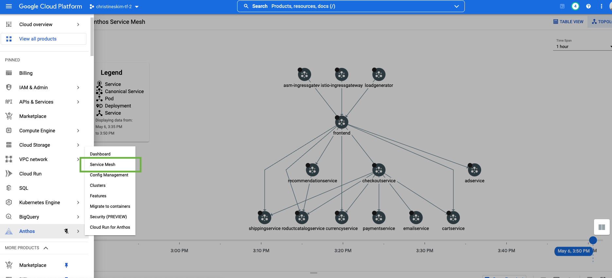
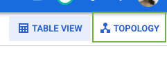

# Canary Testing 

## Introduction 
Canary Testing is integral with testing when completing upgrades on your cluster.

* In this folder, we will learn how to Traffic Split to perform a Canary service deployment on [Google Kubernetes Engine](https://cloud.google.com/kubernetes-engine/) with [Anthos Service Mesh](https://cloud.google.com/service-mesh/docs/overview).
<!-- * In `canary-cp`, we will learn how to safely complete a Control Plane Canary upgrade with ASM  -->
Anthos Service Mesh is Google's fully managed Istio-compliant service mesh. This means that Istio's APIs work with ASM.


In this sample, `productcatalogservice-v2` introduces a 3-second
[latency](https://github.com/GoogleCloudPlatform/microservices-demo/tree/main/src/productcatalogservice#latency-injection) into all server requests. We’ll show how to use Cloud Operations and ASM together to
view the latency difference between the existing `productcatalog` deployment and the slower v2 deployment.

## Prerequisites 
Ensure that you have the prerequisites for running ASM on your GCP Project
https://cloud.google.com/service-mesh/docs/unified-install/anthos-service-mesh-prerequisites
## Setup
There are various methods for setting up your environment with Anthos Service Mesh. For this tutorial, the quickest method is to follow the steps in the `/docs/terraform-asm-mcp` folder in this repo, where you will use **Terraform** to setup the following: 
* a GKE Cluster 
* Anthos Service Mesh with the Managed Control Plane

Make sure you run the [Verify Anthos Service Mesh Installation](https://github.com/GoogleCloudPlatform/anthos-service-mesh-samples/tree/main/docs/terraform-asm-mcp#verify-anthos-service-mesh-installation) before proceeding to the next portion of this tutorial.

## Label the namespace
You must configure all namespaces participating in the service mesh with a `istio.io/rev` label with the version of ASM you are using. In this case, we care using `asm-managed`. 

The istio.io/rev label allows automatic injection of the sidecar Envoy proxies in every Pod within the labeled namespace.
```
kubectl label namespace default istio.io/rev=asm-managed
```
## Deploy the sample app 
For this tutorial we will deploy the microservice-demo app. Run the following
```
kubectl apply -f https://raw.githubusercontent.com/GoogleCloudPlatform/microservices-demo/main/release/kubernetes-manifests.yaml
kubectl apply -f https://raw.githubusercontent.com/GoogleCloudPlatform/microservices-demo/main/release/istio-manifests.yaml
kubectl delete serviceentry allow-egress-google-metadata
kubectl delete serviceentry allow-egress-googleapis
```
Add a label `version=v1` to the `productcatalog` deployment by running the following
```
kubectl patch deployments/productcatalogservice -p '{"spec":{"template":{"metadata":{"labels":{"version":"v1"}}}}}'
```
### View your services
Run the following and make sure that your pods are running, with `2/2` in the colunn `READY`. This ensures that the pods have been successfully injected with the Envoy proxy!
```
kubectl get pods
```
The output should be similar to the following: 
```
NAME                                     READY   STATUS    RESTARTS   AGE
adservice-85598d856b-m84m6               2/2     Running   0          2m7s
cartservice-c77f6b866-m67vd              2/2     Running   0          2m8s
checkoutservice-654c47f4b6-hqtqr         2/2     Running   0          2m10s
currencyservice-59bc889674-jhk8z         2/2     Running   0          2m8s
emailservice-5b9fff7cb8-8nqwz            2/2     Running   0          2m10s
frontend-77b88cc7cb-mr4rp                2/2     Running   0          2m9s
loadgenerator-6958f5bc8b-55q7w           2/2     Running   0          2m8s
paymentservice-68dd9755bb-2jmb7          2/2     Running   0          2m9s
productcatalogservice-84f95c95ff-c5kl6   2/2     Running   0          114s
recommendationservice-64dc9dfbc8-xfs2t   2/2     Running   0          2m9s
redis-cart-5b569cd47-cc2qd               2/2     Running   0          2m7s
shippingservice-5488d5b6cb-lfhtt         2/2     Running   0          2m7s
```
---
## Setup your Ingress Gateway

Create a namespace for your ingress `export GATEWAY_NAMESPACE=asm-ingress`. You can see best practices for deploying gateways [here](https://cloud.google.com/service-mesh/docs/gateways)
```
kubeclt create namespace $GATEWAY_NAMESPACE
kubectl label namespace ${GATEWAY_NAMESPACE} istio.io/rev=asm-managed
# Note replace `asm-managed` with your release channel if you changed it in the Terraform setup
```
Deploy the IngressGateway by running the following: 
```
kubeclt apply -f asm-gateway.yaml -n $GATEWAY_NAMESPACE
kubeclt apply -f gateway.yaml -n $GATEWAY_NAMESPACE
kubectl apply -f frontend-vs.yaml # this will direct the traffic to the frontend after hitting the Gatway
```
## Access through the Gateway
Run the following to get your IP address of your Ingress Gateway
```
echo -n "http://" && \
kubectl -n ${GATEWAY_NAMESPACE} \
  get svc asm-ingressgateway -o json | jq -r '.status.loadBalancer.ingress[0].ip'
```
## Deploy v2 of `productcatalog`

Change into the `canary-service` directory
```
cd canary-testing/canary-service
```
Create a DestinationRule for `productcatalogservice`. 
```
kubectl apply -f destination.yaml
```
Deploy a v2 of your `productcatalog`. This `productcatalog` introduces a [latency](canary-service/productcatalog-v2.yaml) in the response time of 3 seconds
```
kubeclt apply -f productcatalog-v2.yaml
```
Check your pods 
```
kubectl get pods
```
Your output should be similar to the following 
```
NAME                                        READY   STATUS    RESTARTS   AGE
adservice-85598d856b-8wqfd                  2/2     Running   0          25h
cartservice-c77f6b866-7jwcr                 2/2     Running   0          25h
checkoutservice-654c47f4b6-n8c6x            2/2     Running   0          25h
currencyservice-59bc889674-l5xw2            2/2     Running   0          25h
emailservice-5b9fff7cb8-jjr89               2/2     Running   0          25h
frontend-77b88cc7cb-bwtk4                   2/2     Running   0          25h
loadgenerator-6958f5bc8b-lqmnw              2/2     Running   0          25h
paymentservice-68dd9755bb-dckrj             2/2     Running   0          25h
productcatalogservice-84f95c95ff-ddhjv      2/2     Running   0          25h
productcatalogservice-v2-6df4cf5475-9lwjb   2/2     Running   0          8s
recommendationservice-64dc9dfbc8-7s7cx      2/2     Running   0          25h
redis-cart-5b569cd47-vw7lw                  2/2     Running   0          25h
shippingservice-5488d5b6cb-dj5gd            2/2     Running   0          25h
```
Check the frontend with your `EXTERNAL_IP`, and you should note that the frontend loads slower periodically!

## Explore in the Anthos Service Mesh UI
Navigate to the Anthos Service Mesh Dashboard in your GCP Console 
(See service mesh in the 2nd option from the menu, highlighted in green)


Click on `Topology View` in the top right of the console.



Here you can observe the topology layout of your apps, as well as metrics when you focus on specific services.
Return to the `Table View`

Explore around the UI. You can view your services interacting with each other, and is helpful for visualizing traffic behavior. This is just a simple example of the observability and traffic management you can benefit from by using Anthos Service Mesh.

## Clean up
To avoid incurring charges to your Google Cloud account for the resources used in this tutorial, either **delete the project** that contains the resources, or keep the project and delete the individual resources
To delete the cluster: 
* gcloud container clusters delete CLUSTER_NAME  \
    --project=PROJECT_ID \
    --zone=CLUSTER_LOCATION 